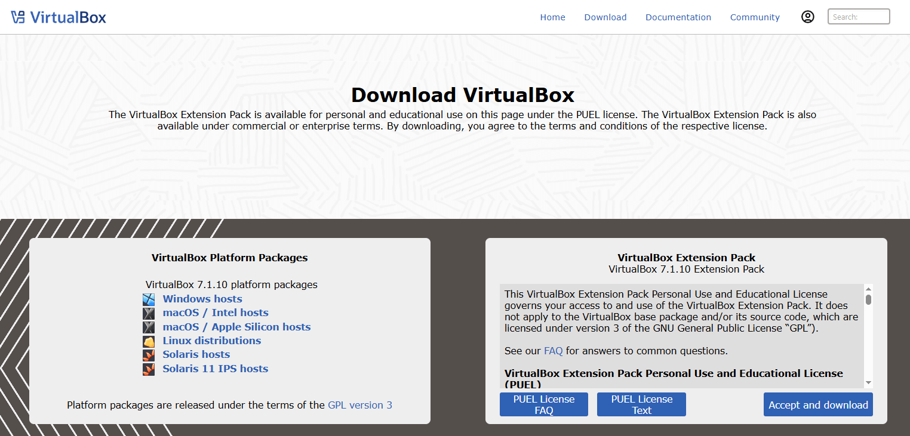
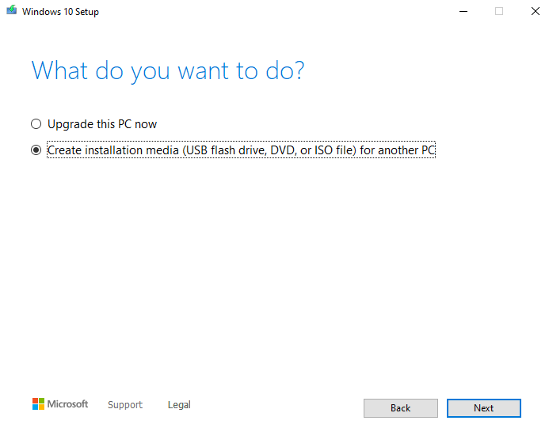
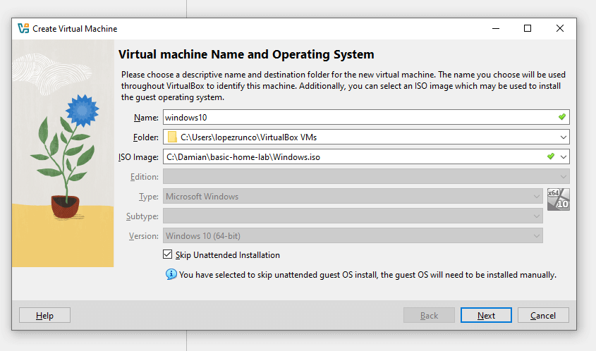
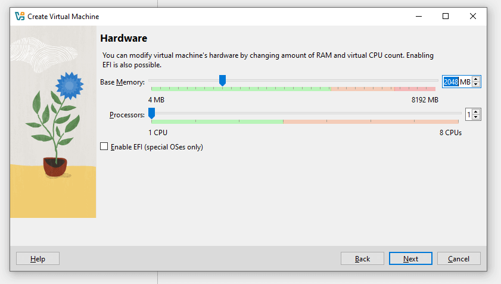
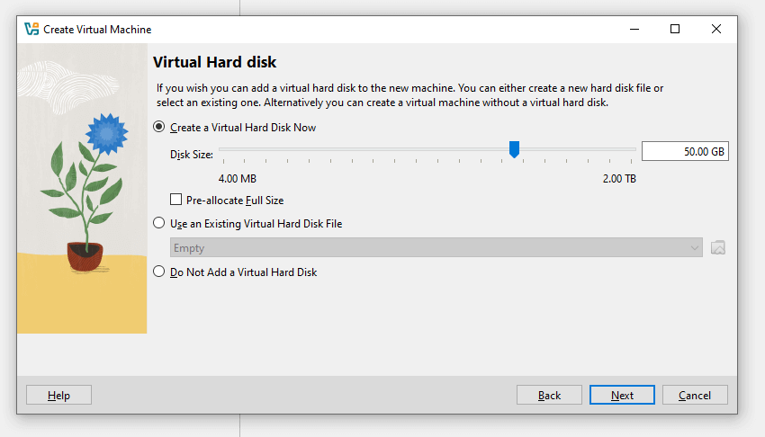
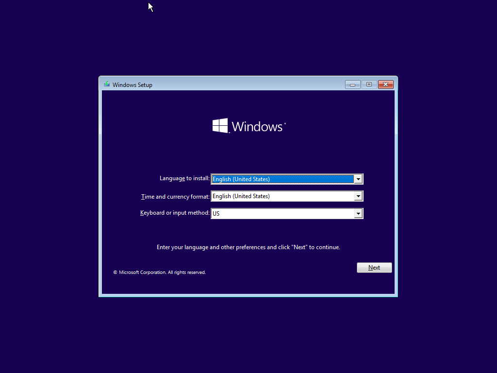
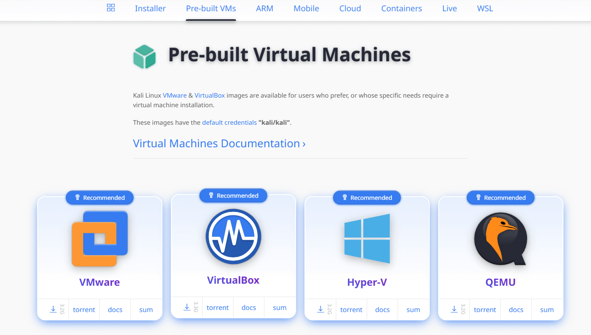
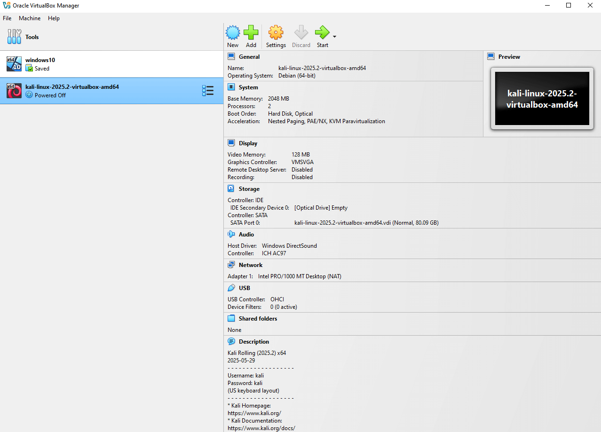

# Active Directory Lab

## Project description

In short, we can think of **Active Directory** as *Database* that contains users, computers, groups and more.
In order to use Active Directory, a server must install a service called **Active Directory Domain Services** (ADDS), and the server must then be promoted to a **Domain controller** (DC), by doing this, it will allows to perform **Authentication** using a protocol called **Kerberos** and **Authorization**.

I will be using:

- Target machine (Windows 10)
- Attacker machine (Kali Linux)
- Active Directory (Windows Server 2022)
- Splunk (Ununtu Server)
- Virtual Box

## 1. Download and install VirtualBox

Go to the [Virtual box download page](https://www.virtualbox.org/wiki/Downloads) and click on **Windows hosts**.



While it’s downloading, go ahead and check the `SHA256 checksums` to verify that the downloaded file has not been altered. To do this, go to your `Downloads` folder (or wherever you saved the installer), open a PowerShell console, and type:

```powershell
    Get-FileHash .\VirtualBox-7.1.10-169112-Win.exe  
```

This will return a SHA256 hash. Copy the hash, go back to the `SHA256 checksums` page on the VirtualBox website, and check if the hash matches one of the listed values (use Ctrl + F and paste the hash to search).

If the hash matches, you can be confident that the file was not altered during download. Now you can proceed with the installation of VirtualBox—just follow the instructions in the setup wizard and you should be good to go.

## 2. Install Windows 10

Go to [this link](https://www.microsoft.com/en-ca/software-download/windows10), scroll down to the **Create Windows 10 installation media** section and click **Download now**. This will download the Media Creation Tool, which will help us create the Windows 10 image file.

Once you run the tool, on the **What do you want to do?** screen, select **Create installation media**, then choose **ISO file**.



After downloading the Windows 10 ISO file, open VirtualBox and create your first virtual machine.

Click on **New**, and the **Create Virtual Machine** wizard. wizard will appear. Name the machine `windows10`, select the ISO image, and check the box **Skip unattended installation** — this allows us to install the operating system manually. 

Click **Next** to view the virtual machine specifications.



Note that these settings will depend on your computer's specifications. In this example, I’ll assign **2048 MB** of base memory and **1 CPU** under the processor settings.



For the virtual hard disk, I’ll leave it at **50 GB** and click **Next**.



Next, the wizard will show you a summary of your virtual machine settings. If everything looks good, click **Finish**.

To power on your Windows 10 machine, simply click **Start**. You should now see the Windows 10 setup screen.



Click on **Install**, and when you reach the **Activate Windows** screen, click **I don't have a product key**. Then, from the list of options, select **Windows 10 Pro** and click **Next**. Accept the license terms.

On the next screen, choose **Custom: Install Windows only (advanced)**, select the drive, and click **Next**. Windows 10 should now begin installing in the background.

## 3. Install Kali Linux

First, navigate to the [Kali website](https://www.kali.org), click on **Download**, and then select the **Pre-built VMs** menu item. I’ll be downloading the 64-bit version of Kali, but you should choose the option that matches your system architecture.



A `.7z` file will be downloaded, so you’ll need **7-Zip** to extract its contents. Once decompressed, look for the file with the `.vbox` extension and double-click it. Kali Linux should be automatically imported into VirtualBox.

Now you can start the Kali virtual machine.  
**Note:** The default credentials for the Kali Linux machine are `kali/kali`.



## 4. Install Windows Server

